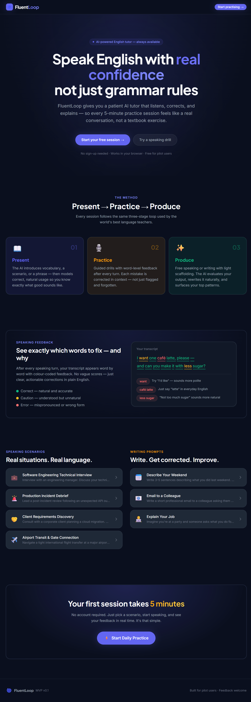
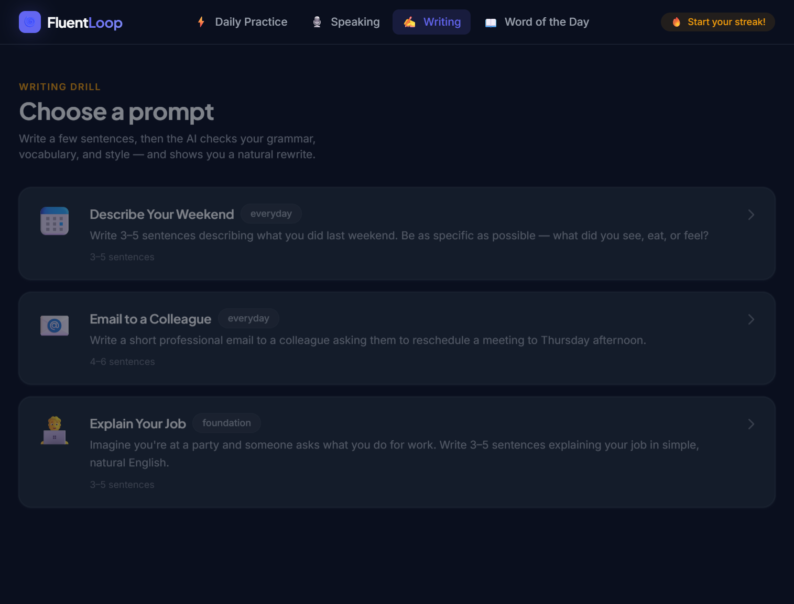
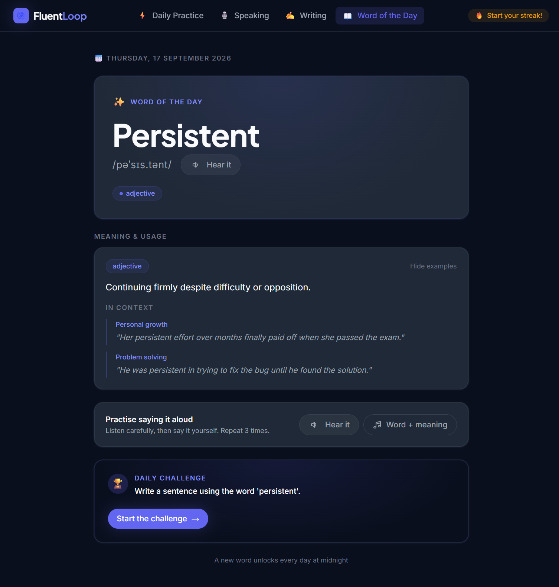
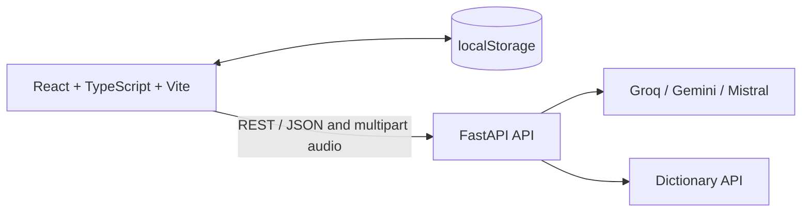

# FluentLoop

FluentLoop is an AI-powered English practice app for realistic speaking, writing, vocabulary, and daily practice sessions.

The frontend is a React + TypeScript + Vite application. The backend is a FastAPI service that coordinates speech transcription, AI feedback, writing evaluation, vocabulary evaluation, and the live Word of the Day lookup. User progress is persisted locally in the browser, so the project does not require a database.

## Features

- Role-play speaking scenarios with live transcription and word-level feedback.
- Custom speaking scenarios with configurable turn counts.
- Three-stage speaking feedback and automatic progression after failed attempts.
- Writing evaluation for grammar, vocabulary, style, and prompt relevance.
- Word of the Day powered by a public dictionary API with a local fallback.
- Browser-persisted streaks, completed sessions, and Word of the Day completion.
- Responsive interface with local development and Docker Compose support.

## Screenshots

### Landing page



### Writing practice



### Word of the Day



## Architecture



### Frontend

The frontend lives in `frontend/` and contains:

- `src/pages/`: route-level experiences for practice, speaking, writing, and vocabulary.
- `src/components/`: shared layout and UI components.
- `src/lib/content-data.ts`: static learning content such as scenarios and writing prompts.
- `src/lib/progressStorage.ts`: the single browser-storage boundary for streaks and local progress.

### Backend

The backend lives in `backend/`:

- `main.py`: FastAPI application, CORS, health check, and router registration.
- `routers/speech.py`: audio transcription, AI conversation, and speech feedback.
- `routers/writing.py`: prompt-aware writing evaluation with provider fallbacks.
- `routers/vocabulary.py`: Word of the Day and sentence evaluation.
- `services/ai_client.py`: configured AI provider clients and model names.
- `services/rate_limiter.py`: request protection for AI-backed endpoints.

### Persistence model

FluentLoop intentionally uses browser storage instead of a database for local-first progress:

- Key: `fluencyloop-progress`
- Stored data: streak, completed sessions, last practice date, level, Word of the Day ID, and completion date.
- Same-tab updates use a custom browser event; cross-tab updates use the `storage` event.

This data is device- and browser-specific. Clearing site data removes it, and it does not synchronize between devices.

## Requirements

- Node.js 20 or newer.
- Python 3.11 or newer.
- An API key for at least one configured AI provider. The current backend startup checks `GROQ_API_KEY`, `GEMINI_API_KEY`, and `MISTRAL_API_KEY`.

## Local setup

### 1. Clone and enter the project

```powershell
git clone <repository-url>
cd FluencyLoop
```

### 2. Configure the backend

Create `backend/.env`:

```env
GROQ_API_KEY=your_groq_key
GEMINI_API_KEY=your_gemini_key
MISTRAL_API_KEY=your_mistral_key
ALLOWED_ORIGINS=http://localhost:5173
```

Create and activate the virtual environment:

```powershell
cd backend
python -m venv .venv
.venv\Scripts\Activate.ps1
python -m pip install --upgrade pip
pip install -r requirements.txt
```

Run the API:

```powershell
python -m uvicorn main:app --reload --port 8000
```

Useful backend URLs:

- Health: `http://localhost:8000/health`
- Swagger UI: `http://localhost:8000/docs`
- ReDoc: `http://localhost:8000/redoc`

### 3. Configure and run the frontend

Create `frontend/.env`:

```env
VITE_API_URL=http://localhost:8000
```

In a second terminal:

```powershell
cd frontend
npm install
npm run dev
```

Open `http://localhost:5173`.

## Docker Compose

Docker Compose runs the frontend and backend together:

```powershell
docker compose up --build
```

The services are available at:

- Frontend: `http://localhost:5173`
- Backend: `http://localhost:8000`

Docker reads backend secrets from `backend/.env`. Do not commit that file.

## API overview

| Method | Endpoint | Purpose |
| --- | --- | --- |
| `GET` | `/health` | Backend liveness check |
| `POST` | `/api/speech/transcribe` | Transcribe and evaluate a speaking turn |
| `POST` | `/api/writing/evaluate` | Evaluate writing and prompt relevance |
| `GET` | `/api/vocabulary/word-of-the-day` | Fetch the daily vocabulary lesson |
| `POST` | `/api/vocabulary/evaluate-sentence` | Evaluate a sentence using the daily word |
| `GET` | `/api/user/progress` | Legacy progress endpoint; local browser storage is the active persistence layer |

## Quality checks

Run these before opening a pull request:

```powershell
cd frontend
npm run lint
npx tsc --noEmit
npm run build
```

```powershell
cd ..
python -m py_compile backend/main.py backend/models/schemas.py backend/routers/*.py
```

## Git workflow

Use focused branches and categorized commits:

```powershell
git switch -c feat/short-description
git add path/to/related/files
git commit -m "feat: describe the change"
git switch main
git merge --no-ff feat/short-description
```

Keep `.env` files, virtual environments, build output, and dummy/mock fixtures out of Git.

## License

Add the project license here before publishing the repository.

